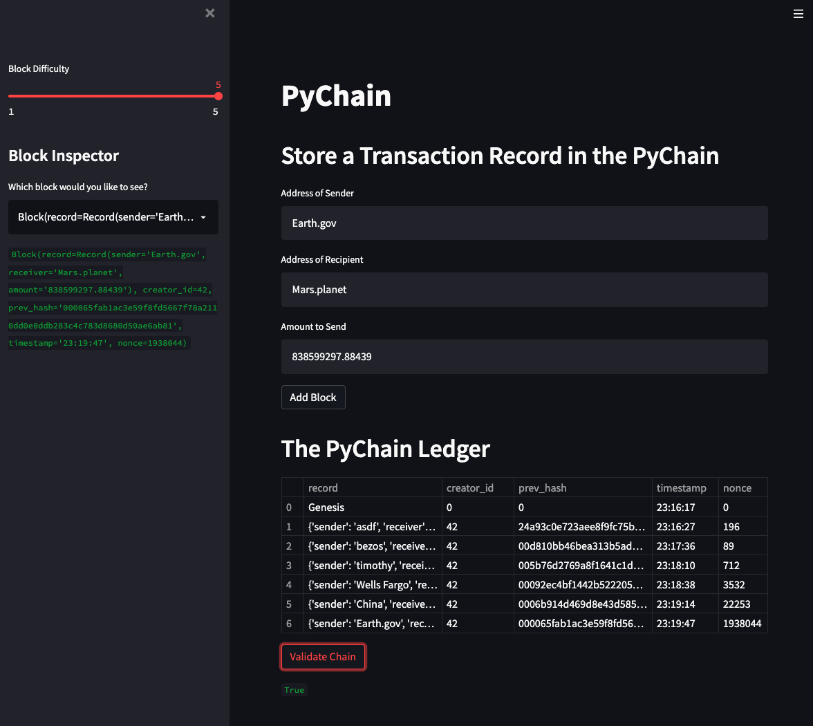
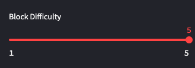
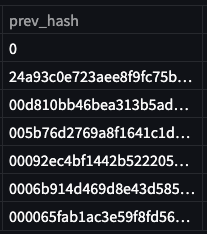
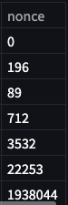
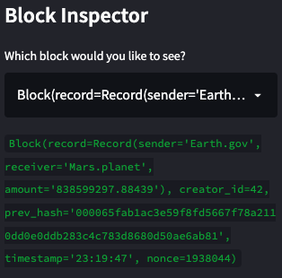
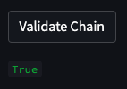

# Python Based Blockchain

## Technologies
  
- Python 3.8
- StreamLit
- pandas
- datetime
- dataclasses
- typing
- hashlib
  
--- 

## About  

Create a timestamped, sequential record of transactions as a dataframe. Create a GUI website where:
- Sender, Receiver, & Amount is entered
- The block mining difficulty is adjusted
- The chain is displayed
- The chain can be validated by checking against previous block hashes
- Each individual block can be explored to view who sent what amount

---

### Webiste Interface
This is what the user views to interact with the following various components of the blockchain.
* **Overall view of webiste & User Interface**  
  
There are multiple text entry areas where the user enters the Sender address, the Recipient address, and the amount being sent.
  
### Mining Difficulty  
The following sections show how to adjust the mining difficulty and the presentation of those changes on-chain.  

* **Difficulty Adjustment Slider**  
  
The slider where the difficulty can be adjusted from 1 through 5. This requires the block hash to have this many "leading zeros" to become a valid block.  
  
* **Block Hashes with increasing difficulty**  
  
The difficulty was adjusted upwards as additional blocks were mined, which can be seen through the increasing number of leading zeros on the previous block's hash.  

* **Nonce Count as difficulty increases**  
  
The difficulty adjustment is also visible by the increased nonce count. This is due to the mining process not discovering a nonce that allows the resulting hash to satisfy the leading zero requirement to be deemed valid as quickly. This presents as the miner necessarily testing more and more numbers before succeeding.  
  
### Block Explorer & Validation  
* **Block Explorer**  
  
The dropdown menu allows for selection of a block and viewing of all data included in that block.  
  
* **Chain Validation**  
  
The validity of the chain is evaluated by hashing all previous blocks using the displayed nonce. This is more simple than attempting to find the nonce since the correct one is already known and secured to the block. If the chain is valid, this displays as `True` and if it is not valid/has been tampered with, this would display as `False`.   
